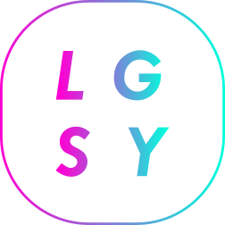
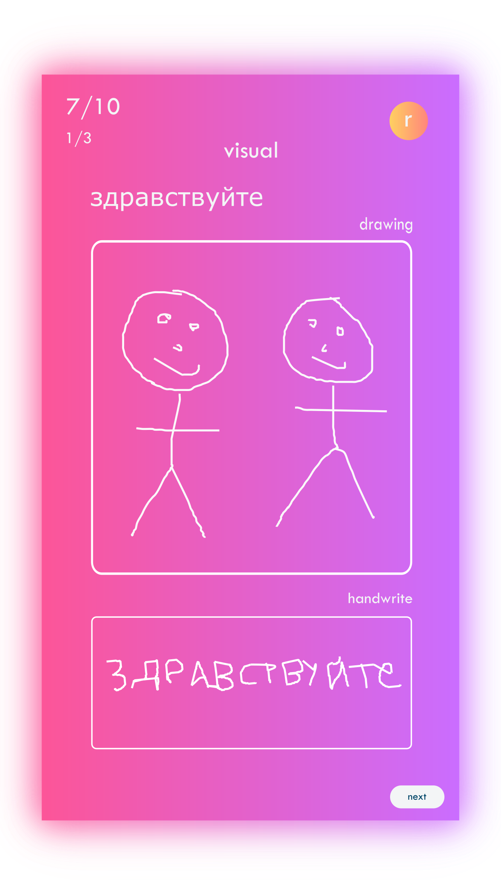
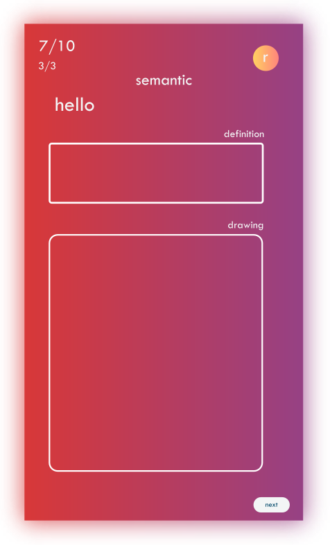
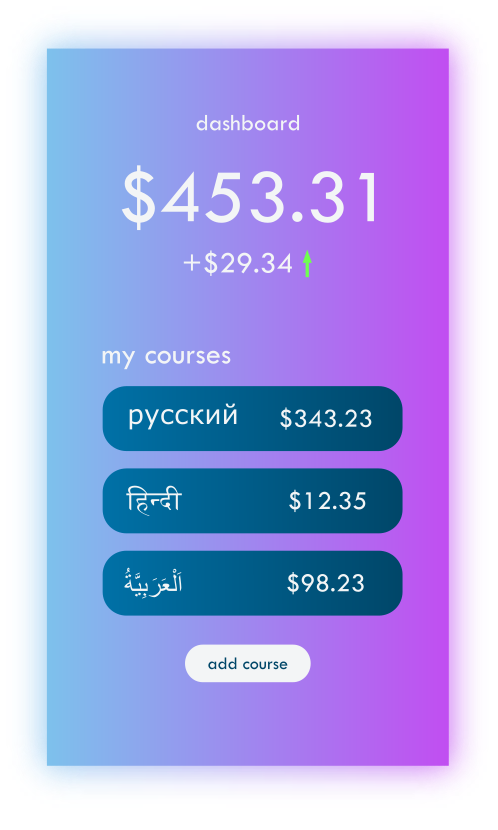

# Langsy

Langsy is a modern take to the language learning process. It uses real principles from the cutting edge of cognitive psychology to best balance ease and retention.

* Reduces **the time** that you can become proficient in a new language.
* Reduces the **hassle** typically associated with language learning

## Who Uses Langsy

* [aditya sriram](https://adityasriram.ga)

## How It Works

### Encoding

#### Visual

  

1. talk about things
2. talk about things
3. talk about things
4. talk about things

#### Semantic

  

1. talk about things
2. talk about things
3. talk about things
4. talk about things

#### Enhanced Spaced Repetition
1. talk about things
2. talk about things
3. talk about things
4. talk about things

### User Retention

#### Variable Ratio Reinforcement Schedule
1. talk about things
2. talk about things
3. talk about things
4. talk about things

#### Monetary Significance

  

1. talk about things
2. talk about things
3. talk about things
4. talk about things

### Content

#### Grammar
1. talk about things
2. talk about things
3. talk about things
4. talk about things

#### Vocabulary
1. talk about things
2. talk about things
3. talk about things
4. talk about things

#### Pattern Recognition over accuracy
1. talk about things
2. talk about things
3. talk about things
4. talk about things
